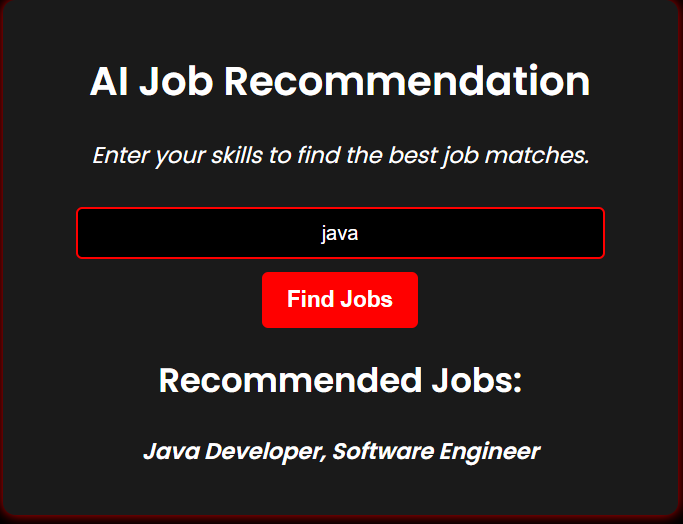

# 🔍 AI Job Recommendation System  

🚀 **AI-powered job recommendation system** that suggests suitable job roles based on user-inputted skills.  

<br/>

## 📸 Project Screenshot

<br/>
<br/>

## 📌 Features  
✅ AI-based job recommendations  
✅ Simple & user-friendly interface  
✅ Responsive design (mobile & desktop)  
✅ Built using Flask (backend) and JavaScript (frontend)  

<br/>
<br/>

## 🛠️ Technologies Used  
### **Frontend:**  
- HTML, CSS, JavaScript  
- Responsive design with **CSS Media Queries**  

### **Backend:**  
- Flask (Python)  
- Machine Learning (**Scikit-Learn, Pandas**)  
- REST API for skill-based recommendations  

<br/>

## 🚀 Installation & Setup  

### **1️⃣ Clone the Repository**  
```bash
git clone https://github.com/srimabose/AI-Job-Recommendation-System.git
cd Job-Recommendation-System


## 🤝 Contributing  
Have ideas to improve this project? Feel free to contribute!  

# 1️⃣ Fork the repo
# 2️⃣ Create a new branch
git checkout -b feature-branch

# 3️⃣ Commit changes
git commit -m "Added new feature"

# 4️⃣ Push to GitHub
git push origin feature-branch

# 5️⃣ Open a Pull Request 🚀

